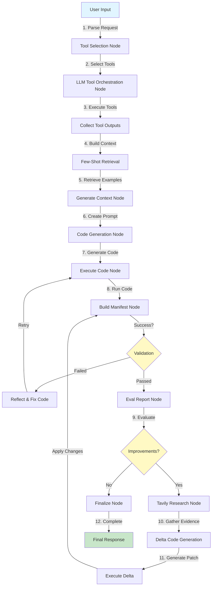

# Data Analytics Agent

> ⚠️ **SECURITY WARNING**: Before pushing to GitHub, ensure your `.env` file is NOT committed! It contains sensitive API keys. See [Security Setup](#security-setup) below.

A sophisticated data analytics agent built with **LangGraph orchestration**, **OpenAI Function Calling**, and **FAISS-based few-shot retrieval** for autonomous financial data analysis and quantitative research.

[](https://www.python.org/downloads/)
[](https://opensource.org/licenses/MIT)

## Overview

This agent provides a complete workflow for data-driven financial analysis:

1. **Tool Selection** - Uses OpenAI function calling to select relevant tools
2. **FAISS-based Few-shot Retrieval** - Retrieves relevant examples with re-ranking
3. **Code Generation** - Uses OpenAI structured outputs for reliable code generation
4. **Code Execution** - Executes generated code with reflection loop for error handling
5. **LangGraph State Management** - Orchestrates the entire workflow with state persistence

---

## 🔄 System Workflow



---

## 📁 File Architecture

### Main Components

| File | Role | Key Functionality |
|------|------|-------------------|
| **`data_analytics_agent_new.py`** | Main orchestrator | LangGraph workflow with 15+ nodes, handles tool selection, code generation, execution, and reflection loops |
| **`tools_registry.py`** | Plugin system | Dynamic tool registration, schema management for OpenAI function calling |
| **`tools_clean.py`** | Data extraction | Financial data tools (Polygon, FRED, FMP) with DataFrame normalization |
| **`validator.py`** | Parameter validation | Auto-corrects invalid params, converts relative dates, validates required fields |
| **`factor_analysis_tools.py`** | Factor engineering | Momentum, value, quality factors with cross-sectional ranking |
| **`backtest_tools.py`** | Backtesting | Portfolio backtester with realistic costs, slippage, 1-bar delay |
| **`visualize1.py`** | Visualization | Plotly helpers with dark theme conventions |

### Core Modules (`core/`)

| Module | Purpose |
|--------|---------|
| **`async_tools.py`** | Async execution engine with rate limiting, retry logic, parallel execution, 2-tier caching |
| **`caching.py`** | Two-tier cache: raw (JSON) + semantic (Parquet) with file locking |
| **`manifest_utils.py`** | Artifact discovery, metadata extraction, manifest validation |
| **`manifests.py`** | Pydantic data structures (TableArtifact, FigureArtifact, ResultManifest) |
| **`prompting_blocks.py`** | Standardized templates (PLOTLY_CONVENTIONS, BACKTEST_HYGIENE, STATS_RIGOR) |
| **`utils.py`** | Parameter normalization, signature generation, JSON serialization |

### Few-Shot Examples (`few_shots/`)

| File | Contains |
|------|----------|
| **`factor_generation.py`** | Factor engineering patterns (momentum, beta, moving averages) |
| **`signal_generation.py`** | Trading signals (rankings, thresholds, multi-asset strategies) |
| **`simple_data_processing.py`** | Data merging, transformation, return calculations |
| **`simple_visuals.py`** | Plotly visualization examples with dark theme |
| **`statistical_analysis.py`** | Regression, correlation, statistical modeling |

**How Few-Shots Work**:
1. `FewShotRetriever` loads all examples at startup
2. Builds FAISS index using sentence-transformers
3. Semantic search on user query + selected tools
4. Cross-encoder re-ranks top candidates
5. Top 3 examples injected into code generation prompt

---

## Setup and Installation

### Security Setup

**⚠️ CRITICAL: Before pushing to GitHub**

1. **Verify .env is NOT tracked**:
   ```bash
   git status
   # .env should NOT appear

   cat .gitignore | grep .env
   # Should show: .env
   ```

2. **If you accidentally committed .env**:
   ```bash
   # Remove from git history using git-filter-repo
   pip install git-filter-repo
   git filter-repo --path .env --invert-paths --force

   # Re-add origin remote (filter-repo removes it)
   git remote add origin https://github.com/YOUR_USERNAME/REPO_NAME.git

   # Force push cleaned history
   git push origin main --force

   # REVOKE all exposed API keys from provider dashboards!
   # Generate new keys and update .env
   ```

3. **Create your local .env**:
   ```bash
   cp .env.example .env
   # Edit .env and add your real API keys
   ```

### Requirements

```bash
pip install -r requirements.txt
```

### Core Dependencies
- `pandas>=2.2.0` - Data manipulation
- `numpy>=1.26.0` - Numerical computing
- `pydantic>=2.11.0` - Data validation
- `langgraph>=0.2.0` - Workflow orchestration
- `openai>=1.12.0` - LLM API
- `tenacity>=8.2.0` - Retry logic
- `aiolimiter>=1.1.0` - Rate limiting
- `plotly>=5.22.0` - Visualization
- `faiss-cpu` - Semantic search (optional)
- `sentence-transformers` - Embeddings (optional)

### Environment Variables

Required keys in `.env`:

```bash
# Required
OPENAI_API_KEY=your_openai_api_key
POLYGON_API_KEY=your_polygon_api_key  # For stock data
FRED_API_KEY=your_fred_api_key        # For economic data
FMP_API_KEY=your_fmp_api_key          # For fundamentals

# Optional
TAVILY_API_KEY=your_tavily_key        # For web research
LANGCHAIN_API_KEY=your_langchain_key  # For tracing
OPENAI_MODEL=gpt-5                    # Default model
AGENT_DATA_DIR=/path/to/data          # Data storage
PLANNER_MAX_TURNS=3                   # Planning iterations
```

---

## Usage Examples

### Basic Usage

```python
from data_analytics_agent import DataAnalyticsAgent

# Initialize agent
agent = DataAnalyticsAgent()

# Process request
response = agent.process_request(
    "Create a moving average crossover strategy for AAPL and TSLA, "
    "going long when 10-day MA crosses above 50-day MA"
)

print(response)
```

### Advanced Multi-Asset Analysis

```python
response = agent.process_request(
    "For the last 4 years, extract US CPI data monthly and calculate "
    "rolling 2-year beta of AAPL, TSLA, NVDA, GOOGL, AMZN, MSFT, NFLX "
    "returns with CPI changes. Create a ranking strategy going long on "
    "low beta stocks and short on high beta stocks."
)
```

---

## Output Structure

### Data Directory Structure
```
.agent_data/
└── runs/
    └── {run_id}/
        └── reflection_{iteration}/
            ├── result.json         # Manifest
            ├── *.csv/*.parquet     # Data tables
            └── *.html/*.png        # Visualizations
```

### Result Manifest (`result.json`)
```json
{
  "tables": [
    {
      "path": "momentum_signals.csv",
      "rows": 252,
      "columns": ["date", "AAPL", "TSLA", "signal"],
      "schema": {"date": "datetime64[ns]", "AAPL": "float64", ...},
      "description": "Daily momentum signals for selected tickers"
    }
  ],
  "figures": [
    {
      "path": "strategy_backtest.html",
      "caption": "Moving Average Crossover Strategy Performance",
      "format": "html"
    }
  ],
  "metrics": {
    "sharpe_ratio": 1.23,
    "max_drawdown": -0.15,
    "total_return": 0.34,
    "win_rate": 0.58
  },
  "explanation": "Strategy analysis and results summary..."
}
```

---

## Configuration & Best Practices

### Custom Tool Configuration

```python
from core.async_tools import AsyncToolExecutor, ToolConfig

tool_overrides = {
    "bulk_extract_daily_closing_prices_from_polygon": ToolConfig(
        calls_per_second=1.0,  # Slower for bulk operations
        timeout_sec=120.0,
        max_retries=2
    )
}
```

### Best Practices

**Data Management**:
- Use semantic keys for consistent data referencing
- Leverage caching for repeated analyses
- Organize data with 'date' as first column

**Code Generation**:
- Follow OUTPUT_CONTRACT for consistent results
- Use Plotly dark theme for visualizations
- Persist all intermediate results with manifest

**Backtesting Hygiene**:
- Implement realistic trading costs and slippage
- Ensure 1-bar signal delay (no look-ahead bias)
- Report comprehensive risk metrics (Sharpe, max drawdown, etc.)

**Performance Optimization**:
- Configure appropriate rate limits for each data source
- Use bulk extraction tools when fetching multiple tickers
- Enable caching to avoid redundant API calls

---

## Troubleshooting

**Common Issues**:
- **Missing API Keys**: Ensure all required vars are set in `.env`
- **Rate Limit Errors**: Reduce `calls_per_second` in tool config
- **Memory Issues**: Use parquet format for large datasets
- **Code Execution Timeout**: Increase `CODE_EXECUTION_TIMEOUT` (default: 1800s)

**Debugging**:
```bash
# Enable debug logging
export PYTHONUNBUFFERED=1

# View run directory
ls -la .agent_data/runs/{run_id}/

# Check manifest
cat .agent_data/runs/{run_id}/reflection_0/result.json

# Review generated code
cat .agent_data/runs/{run_id}/graph_state.json | jq '.final_state.generated_code'
```

---

## Contributing

See [CONTRIBUTING.md](CONTRIBUTING.md) for detailed guidelines on:
- Adding new tools
- Creating few-shot examples
- Code style and testing
- Submitting pull requests

**Quick Start for Contributors**:
1. Fork the repository
2. Create feature branch: `git checkout -b feature/my-tool`
3. Add tool plugin inheriting from `ToolPlugin`
4. Add validation logic in `validator.py`
5. Create tests in `tests/`
6. Submit PR with clear description

---

## License

This project is licensed under the MIT License. See [LICENSE](LICENSE) file for details.

---

## Support

For questions and support:
- Create an issue in the GitHub repository
- Review [CONTRIBUTING.md](CONTRIBUTING.md) for development guidelines
- Check example code in `few_shots/` directory
- See [CLAUDE.md](CLAUDE.md) for advanced engineering patterns

---

## Acknowledgments

Built with:
- [LangGraph](https://github.com/langchain-ai/langgraph) - Workflow orchestration
- [OpenAI](https://openai.com/) - Code generation and function calling
- [FAISS](https://github.com/facebookresearch/faiss) - Semantic search
- [Polygon.io](https://polygon.io/) - Financial market data
- [FRED](https://fred.stlouisfed.org/) - Economic data
- [Tavily](https://tavily.com/) - Web research API
