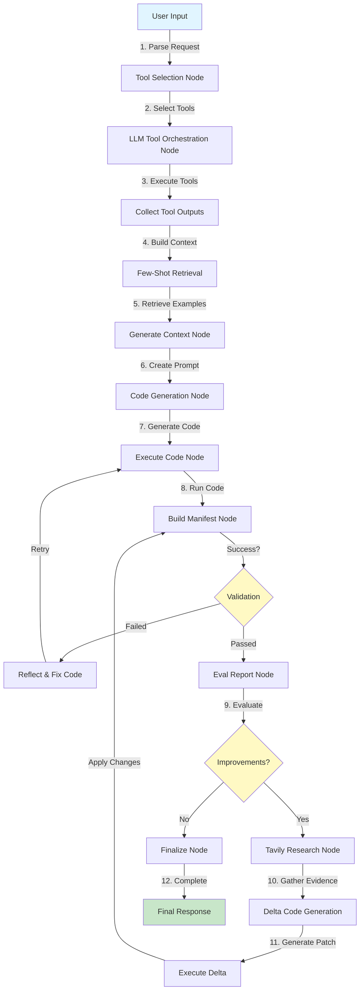

# Data Analytics Agent

> ⚠️ **SECURITY WARNING**: Before pushing to GitHub, ensure your `.env` file is NOT committed! It contains sensitive API keys. See [Security Setup](#security-setup) below.

A sophisticated data analytics agent built with **LangGraph orchestration**, **OpenAI Function Calling**, and **FAISS-based few-shot retrieval** for autonomous financial data analysis and quantitative research.

[](https://www.python.org/downloads/)
[](https://opensource.org/licenses/MIT)

## Overview

This agent provides a complete workflow for data-driven financial analysis:

1. **Tool Selection** - Uses OpenAI function calling to select relevant tools
2. **FAISS-based Few-shot Retrieval** - Retrieves relevant examples with re-ranking
3. **Code Generation** - Uses OpenAI structured outputs for reliable code generation
4. **Code Execution** - Executes generated code with reflection loop for error handling
5. **LangGraph State Management** - Orchestrates the entire workflow with state persistence

---

## 🔄 System Workflow

### High-Level Flow



### Detailed Execution Flow

```
┌─────────────────────────────────────────────────────────────────┐
│                     INITIALIZATION PHASE                         │
├─────────────────────────────────────────────────────────────────┤
│  1. User submits request                                         │
│  2. select_tools_node: OpenAI function calling selects tools     │
│  3. State: selected_tools = ["tool1", "tool2", ...]             │
└─────────────────────────────────────────────────────────────────┘
                              ↓
┌─────────────────────────────────────────────────────────────────┐
│                    TOOL ORCHESTRATION PHASE                      │
├─────────────────────────────────────────────────────────────────┤
│  4. llm_tool_orchestration_node:                                 │
│     - Multi-turn planner (up to 3 turns)                        │
│     - LLM plans tool parameters                                 │
│     - Validator corrects invalid parameters                     │
│     - AsyncToolExecutor executes tools in parallel              │
│       * Rate limiting (per-tool configs)                        │
│       * Exponential backoff retries                             │
│       * Two-tier caching (semantic + raw)                       │
│     - Stores results in tool_outputs, tool_files                │
│  5. collect_tool_outputs_node: Normalizes outputs               │
│  6. State: tool_outputs = {semantic_key: dataset_descriptor}    │
└─────────────────────────────────────────────────────────────────┘
                              ↓
┌─────────────────────────────────────────────────────────────────┐
│                    CODE GENERATION PHASE                         │
├─────────────────────────────────────────────────────────────────┤
│  7. retrieve_few_shots_node:                                     │
│     - FAISS semantic search on user query + tools               │
│     - Cross-encoder re-ranks top candidates                     │
│     - Returns top 3 most relevant examples                      │
│  8. generate_context_node:                                       │
│     - Builds composite prompt with:                             │
│       * Tool output summaries (rows, columns, date ranges)      │
│       * Few-shot examples                                       │
│       * Standard conventions (PLOTLY, BACKTEST_HYGIENE, etc.)   │
│  9. generate_code_node:                                          │
│     - OpenAI structured outputs (Pydantic schema)               │
│     - Generates complete executable Python script               │
│     - State: generated_code = "import pandas as pd\n..."        │
└─────────────────────────────────────────────────────────────────┘
                              ↓
┌─────────────────────────────────────────────────────────────────┐
│                    EXECUTION & REFLECTION PHASE                  │
├─────────────────────────────────────────────────────────────────┤
│ 10. execute_code_node:                                           │
│     - Creates iteration-specific workdir                        │
│     - Sets DATA_DIR environment variable                        │
│     - Executes code in subprocess (timeout: 30 min)             │
│     - Captures stdout, stderr, return code                      │
│ 11. build_manifest_node:                                         │
│     - Scans workdir for tables (csv, parquet)                   │
│     - Scans workdir for figures (html, png, svg)                │
│     - Validates result.json manifest                            │
│     - Extracts metadata (rows, columns, dtypes)                 │
│     - If FAILED → reflect_code_node (up to 3 attempts)          │
│ 12. State: result_manifest = ResultManifest(tables, figures)    │
└─────────────────────────────────────────────────────────────────┘
                              ↓
┌─────────────────────────────────────────────────────────────────┐
│                   IMPROVEMENT LOOP PHASE                         │
├─────────────────────────────────────────────────────────────────┤
│ 13. eval_report_node:                                            │
│     - Analyzes current results vs. user request                 │
│     - Identifies unused tools that could add value              │
│     - Generates EvalReport with:                                │
│       * improvements: List[{description, rationale}]            │
│       * research_queries: List[ResearchQuery]                   │
│       * new_tool_suggestions: List[ToolSuggestion]              │
│ 14. tavily_research_node (if queries exist):                    │
│     - Executes web research via Tavily API                      │
│     - Gathers evidence for each research query                  │
│     - Synthesizes findings with citations                       │
│     - Proposes TavilyActions (local, computable changes)        │
│ 15. delta_code_generation_node:                                  │
│     - Generates code patch to append in DELTA block             │
│     - Uses only local datasets (no new tool calls)              │
│     - Adds new columns, metrics, figures                        │
│ 16. execute_delta_node → build_manifest_node (acceptance test)  │
│ 17. Loop continues until no improvements or budget exhausted    │
└─────────────────────────────────────────────────────────────────┘
                              ↓
┌─────────────────────────────────────────────────────────────────┐
│                      FINALIZATION PHASE                          │
├─────────────────────────────────────────────────────────────────┤
│ 18. finalize_node:                                               │
│     - Formats final response with manifest summary              │
│     - Lists all tables and figures with paths                   │
│     - Reports key metrics (Sharpe, returns, etc.)               │
│     - Saves graph state to graph_state.json                     │
│ 19. Return: Final response string to user                       │
└─────────────────────────────────────────────────────────────────┘
```

---

## 📁 File Architecture

### Main Orchestrator

#### `data_analytics_agent_new.py` (Main Entry Point)
**Role**: LangGraph workflow orchestrator and agent entry point

**What it does**:
- Defines `AgentState` (TypedDict) that flows through all nodes
- Implements 15+ LangGraph nodes (select_tools, orchestrate, generate_code, execute, etc.)
- Wires nodes into a StateGraph with conditional routing
- Manages reflection loops (code fixes) and improvement rounds (delta patches)
- Handles FAISS few-shot retrieval initialization
- Integrates with AsyncToolExecutor for parallel tool execution

**Key Functions**:
- `select_tools_node()` - OpenAI function calling to pick tools
- `llm_tool_orchestration_node()` - Multi-turn planner with validation
- `retrieve_few_shots_node()` - FAISS semantic search
- `generate_code_node()` - Structured code generation
- `execute_code_node()` - Subprocess execution with timeout
- `build_manifest_node()` - Artifact discovery and validation
- `eval_report_node()` - Post-execution improvement planning
- `tavily_research_node()` - Web research via Tavily API
- `delta_code_generation_node()` - Incremental code patching

**Dependencies**: All other modules flow into this orchestrator

---

### Tool System

#### `tools_registry.py`
**Role**: Plugin-based tool registration system

**What it does**:
- Defines `ToolPlugin` abstract base class
- Provides `ToolRegistry` for dynamic tool registration
- Implements `auto_register()` to scan and load plugins
- Returns tool schemas for OpenAI function calling
- Maps tool names to semantic keys and executors

**Used by**:
- `data_analytics_agent_new.py` imports `REGISTRY` global
- `llm_tool_orchestration_node()` calls `REGISTRY.get_tool_schemas()`
- `AsyncToolExecutor` queries registry for plugin execution

#### `tools_clean.py`
**Role**: Financial data extraction tool implementations

**What it does**:
- Implements `ToolPlugin` subclasses for each data source:
  * `ExtractDailyStockDataPlugin` - Polygon OHLCV data
  * `BulkExtractDailyClosingPricesPlugin` - Multi-ticker closing prices
  * `ExtractEconomicDataPlugin` - FRED economic indicators
  * `ExtractFundamentalsPlugin` - FMP financial statements
  * `ExtractAnalystEstimatesPlugin` - FMP analyst estimates
- Each plugin provides `execute(params)` and `semantic_key()`
- Normalizes outputs to DataFrames with standardized date columns

**Used by**:
- `tools_registry.py` auto-registers these plugins
- `AsyncToolExecutor.execute_many()` calls plugin.execute()
- Results stored in `state["tool_outputs"][semantic_key]`

#### `validator.py`
**Role**: Parameter validation and auto-correction

**What it does**:
- Defines `validate_tool_params(tool_name, params)` function
- Checks required fields (ticker, date ranges, etc.)
- Auto-corrects invalid dates (e.g., "2023-13-01" → "2023-12-01")
- Converts relative dates ("last 2 years" → absolute dates)
- Returns `(ok: bool, fixed_params: dict, issues: list)`

**Used by**:
- `llm_tool_orchestration_node()` calls `REGISTRY.validate()`
- Registry forwards to `validate_tool_params()`
- Fixed params are used for actual tool execution

#### `factor_analysis_tools.py`
**Role**: Factor engineering and quantitative analysis tools

**What it does**:
- Implements factor generation plugins (momentum, value, quality, etc.)
- Provides cross-sectional ranking and portfolio construction
- Implements rolling window factor calculations

**Used by**:
- Registered in `tools_registry.py`
- Selected by LLM when user requests factor-based strategies

#### `backtest_tools.py`
**Role**: Backtesting infrastructure

**What it does**:
- Implements portfolio backtester with realistic assumptions
- Handles transaction costs, slippage, position limits
- Calculates performance metrics (Sharpe, max drawdown, etc.)
- Ensures 1-bar signal delay (no look-ahead bias)

**Used by**:
- Registered as tool plugin
- Called when user requests strategy backtesting

#### `visualize1.py`
**Role**: Visualization utilities

**What it does**:
- Provides plotting helpers for Plotly charts
- Implements dark theme conventions
- Handles HTML export for interactive charts

**Used by**:
- Generated code imports these functions
- Ensures consistent visual style across outputs

---

### Core Execution Engine

#### `core/async_tools.py`
**Role**: Asynchronous tool execution engine with enterprise features

**What it does**:
- Implements `AsyncToolExecutor` class
- **Rate Limiting**: Per-tool rate limits using `AsyncLimiter` (default: 5 calls/sec)
- **Retry Logic**: Exponential backoff with jitter via `tenacity` (default: 3 retries)
- **Parallel Execution**: `execute_many()` runs multiple tools concurrently
- **Caching Integration**: Checks cache before execution, writes cache after
- **DataFrame Normalization**: Converts tool outputs to standardized DataFrames
- **Error Handling**: Captures exceptions, logs failures, returns error records

**Key Classes**:
- `ToolConfig` - Per-tool settings (rate limit, timeout, retries)
- `AsyncToolExecutor` - Main execution coordinator
- `execute_many(tool_params_list)` - Batch execution with parallelism

**Used by**:
- `llm_tool_orchestration_node()` initializes global `GLOBAL_TOOL_EXECUTOR`
- Calls `asyncio.run(executor.execute_many(planned))`
- Results flow into `state["tool_artifacts"]`, `state["tool_outputs"]`

#### `core/caching.py`
**Role**: Two-tier caching system for tool outputs

**What it does**:
- **Raw Cache**: `raw_cache/{tool}/{signature}.json.gz` - Compressed JSON metadata
  * Stores full tool response with schema validation
  * Keyed by deterministic parameter signature
- **Semantic Cache**: `semantic_cache/{semantic_key}/{signature}.parquet` - Normalized DataFrames
  * Stores processed, normalized DataFrame
  * Enables semantic key-based retrieval (multiple param sets → same key)
- **File Locking**: Uses `FileLock` for thread-safe cache operations
- **Signature Generation**: `params_signature(tool, params)` creates deterministic hash

**Key Functions**:
- `load_from_cache(cache_dir, tool, params)` - Attempts cache hit
- `save_to_cache(cache_dir, tool, params, result)` - Persists result
- `get_semantic_cache_path(cache_dir, semantic_key, signature)` - Path resolver

**Used by**:
- `AsyncToolExecutor` checks cache before tool execution
- `execute_one()` writes to cache after successful execution
- Dramatically reduces redundant API calls during development

#### `core/manifest_utils.py`
**Role**: Result artifact discovery and manifest validation

**What it does**:
- Scans execution workdir for output artifacts
- **Artifact Discovery**: Finds all `.csv`, `.parquet`, `.html`, `.png`, `.svg` files
- **Format Inference**: Auto-detects file types and formats
- **Metadata Extraction**:
  * Parquet: Row counts, column names, data types from file metadata
  * CSV: Reads with Pandas to infer schema
- **Manifest Sanitization**: Repairs malformed `result.json` entries
- **Validation**: Ensures listed artifacts actually exist on disk

**Key Functions**:
- `sanitize_or_build_manifest(workdir)` - Main entry point
- `_discover_artifacts(workdir)` - File system scan
- `_extract_parquet_metadata(path)` - Fast metadata extraction
- Returns: `(ResultManifest, warnings: List[str])`

**Used by**:
- `build_manifest_node()` calls `sanitize_or_build_manifest(exec_workdir)`
- Validates code execution produced required outputs
- Manifest stored in `state["result_manifest"]`

#### `core/manifests.py`
**Role**: Data structure definitions (Pydantic models)

**What it does**:
- Defines core data contracts using Pydantic `@dataclass`:
  * `TableArtifact` - Table metadata (path, rows, columns, schema, description)
  * `FigureArtifact` - Figure metadata (path, caption, format)
  * `ResultManifest` - Complete result bundle (tables, figures, metrics, explanation)
- Provides type safety and validation for manifest operations
- Ensures consistent JSON serialization format

**Used by**:
- `manifest_utils.py` constructs these dataclasses
- `build_manifest_node()` stores `ResultManifest` in state
- `finalize_node()` serializes manifest for final response

#### `core/prompting_blocks.py`
**Role**: Standardized prompt templates and conventions

**What it does**:
- Defines multi-line string constants for code generation prompts:
  * `PLOTLY_CONVENTIONS` - Dark theme, log scales, interactive HTML export
  * `BACKTEST_HYGIENE` - No look-ahead, 1-bar delay, realistic frictions
  * `STATS_RIGOR` - Sharpe ratio, PSR, bootstrap confidence intervals
  * `OUTPUT_CONTRACT` - Mandatory result.json with tables/figures/metrics
- Ensures all generated code follows best practices
- Injects domain knowledge into code generation

**Used by**:
- `generate_context_node()` includes these blocks in composite prompt
- `generate_code_node()` receives prompt with conventions embedded
- Ensures consistent output quality across diverse requests

#### `core/utils.py`
**Role**: Shared utility functions

**What it does**:
- **Parameter Normalization**: `normalize_params(obj)` - Recursive dict/object standardization
- **Signature Generation**: `params_signature(tool, params)` - Deterministic hash for caching
- **JSON Serialization**: `canonical_json(obj)` - Sorted keys for consistent hashing
- **Type Coercion**: Handles numpy/pandas types for JSON compatibility

**Key Functions**:
- `params_signature(tool_name, params)` → `"sha256:abcdef..."` (used for cache keys)
- `normalize_params({"date": "2023-01-01", "tickers": ["AAPL"]})` → Canonicalized dict

**Used by**:
- `caching.py` uses `params_signature()` for cache key generation
- `async_tools.py` uses normalization for parameter consistency
- Multiple nodes use JSON serialization helpers

---

### Few-Shot Learning

#### `few_shots/` Directory
**Role**: Example library for code generation

**What it contains**:
- `factor_generation.py` - Factor engineering examples (momentum, beta, etc.)
- `signal_generation.py` - Trading signal examples (rankings, thresholds)
- `simple_data_processing.py` - Data merging and transformation patterns
- `simple_visuals.py` - Plotly visualization examples
- `statistical_analysis.py` - Regression and statistical modeling examples

**Format**: JSON or Python files with list of dicts:
```python
[{
    "question": "Calculate rolling beta with market index",
    "executable_code": "import pandas as pd\n...",
    "code_description": "Computes 60-day rolling beta..."
}]
```

**How it works**:
1. `FewShotRetriever` (in `data_analytics_agent_new.py`) loads all examples at startup
2. Builds FAISS index using `sentence-transformers` embeddings
3. `retrieve_few_shots_node()` performs semantic search on user query
4. Cross-encoder re-ranks candidates for relevance
5. Top 3 examples included in code generation prompt
6. LLM adapts examples to current task

**Impact**:
- Dramatically improves code quality through learned patterns
- Reduces hallucinations by grounding generation in working examples
- Enables domain-specific idioms (e.g., "always use 1-bar delay")

---

## Architecture Summary

### Data Flow Through Main Components

```
User Request
     ↓
[data_analytics_agent_new.py] ← Main Orchestrator
     ↓
1. Tool Selection
     ↓ (selected_tools)
[tools_registry.py] → Query available tools
     ↓ (tool schemas)
2. Tool Orchestration
     ↓ (planned tool calls)
[validator.py] → Validate & fix params
     ↓ (validated params)
[core/async_tools.py] → Execute tools in parallel
     ↓ (check cache)
[core/caching.py] ← Load/save cached results
     ↓ (execute if cache miss)
[tools_clean.py] → Fetch data from APIs
     ↓ (raw data)
[core/async_tools.py] → Normalize to DataFrames
     ↓ (tool_outputs)
3. Few-Shot Retrieval
     ↓ (user query + tools)
[few_shots/*.py] → FAISS semantic search
     ↓ (retrieved examples)
4. Code Generation
     ↓ (composite prompt)
[core/prompting_blocks.py] → Inject conventions
     ↓ (full prompt)
OpenAI API → Generate Python code
     ↓ (generated_code)
5. Execution
     ↓ (code + DATA_DIR)
Subprocess → Run in isolated env
     ↓ (stdout, stderr, files)
[core/manifest_utils.py] → Discover artifacts
     ↓ (scan workdir)
[core/manifests.py] → Build ResultManifest
     ↓ (result_manifest)
6. Improvement Loop (Optional)
     ↓ (eval report)
Tavily API → Web research
     ↓ (evidence)
[data_analytics_agent_new.py] → Delta code patch
     ↓ (DELTA block)
(Back to step 5 for re-execution)
     ↓
7. Finalization
     ↓ (manifest summary)
Final Response → User
```

---

## Setup and Installation

### Security Setup

**⚠️ CRITICAL: Before pushing to GitHub**

1. **Verify .env is NOT tracked**:
   ```bash
   git status
   # .env should NOT appear in untracked files if you've already created it

   cat .gitignore | grep .env
   # Should show: .env
   ```

2. **If you accidentally committed .env**:
   ```bash
   # Remove from git history
   git rm --cached .env
   git commit -m "Remove .env from tracking"

   # REVOKE all API keys in the exposed .env!
   # Generate new keys from provider dashboards
   ```

3. **Create your local .env**:
   ```bash
   cp .env.example .env
   # Edit .env and add your real API keys
   ```

### Requirements

```bash
pip install -r requirements.txt
```

### Core Dependencies
- `pandas>=2.2.0` - Data manipulation
- `numpy>=1.26.0` - Numerical computing
- `pydantic>=2.11.0` - Data validation
- `tenacity>=8.2.0` - Retry logic
- `aiolimiter>=1.1.0` - Rate limiting
- `plotly>=5.22.0` - Visualization
- `faiss-cpu` - Semantic search (optional)
- `sentence-transformers` - Embeddings (optional)

### Environment Variables

Required keys in `.env`:

```bash
# Required
OPENAI_API_KEY=your_openai_api_key
POLYGON_API_KEY=your_polygon_api_key  # For stock data
FRED_API_KEY=your_fred_api_key        # For economic data
FMP_API_KEY=your_fmp_api_key          # For fundamentals

# Optional
TAVILY_API_KEY=your_tavily_key        # For web research
LANGCHAIN_API_KEY=your_langchain_key  # For tracing
OPENAI_MODEL=gpt-5                    # Default model
AGENT_DATA_DIR=/path/to/data          # Data storage
PLANNER_MAX_TURNS=3                   # Planning iterations
```

---

## Usage Examples

### Basic Usage

```python
from data_analytics_agent import DataAnalyticsAgent

# Initialize agent
agent = DataAnalyticsAgent()

# Process request
response = agent.process_request(
    "Create a moving average crossover strategy for AAPL and TSLA, "
    "going long when 10-day MA crosses above 50-day MA"
)

print(response)
```

### Advanced Multi-Asset Analysis

```python
response = agent.process_request(
    "For the last 4 years, extract US CPI data monthly and calculate "
    "rolling 2-year beta of AAPL, TSLA, NVDA, GOOGL, AMZN, MSFT, NFLX "
    "returns with CPI changes. Create a ranking strategy going long on "
    "low beta stocks and short on high beta stocks."
)
```

---

## Output Structure

### Data Directory Structure
```
.agent_data/
└── runs/
    └── {run_id}/
        └── reflection_{iteration}/
            ├── result.json         # Manifest
            ├── *.csv/*.parquet     # Data tables
            └── *.html/*.png        # Visualizations
```

### Result Manifest (`result.json`)
```json
{
  "tables": [
    {
      "path": "momentum_signals.csv",
      "rows": 252,
      "columns": ["date", "AAPL", "TSLA", "signal"],
      "schema": {"date": "datetime64[ns]", "AAPL": "float64", ...},
      "description": "Daily momentum signals for selected tickers"
    }
  ],
  "figures": [
    {
      "path": "strategy_backtest.html",
      "caption": "Moving Average Crossover Strategy Performance",
      "format": "html"
    }
  ],
  "metrics": {
    "sharpe_ratio": 1.23,
    "max_drawdown": -0.15,
    "total_return": 0.34,
    "win_rate": 0.58
  },
  "explanation": "Strategy analysis and results summary..."
}
```

---

## Advanced Configuration

### Custom Tool Configuration

```python
from core.async_tools import AsyncToolExecutor, ToolConfig

# Custom rate limits per tool
tool_overrides = {
    "bulk_extract_daily_closing_prices_from_polygon": ToolConfig(
        calls_per_second=1.0,  # Slower for bulk operations
        timeout_sec=120.0,     # Longer timeout
        max_retries=2          # Fewer retries
    )
}

executor = AsyncToolExecutor(
    registry=registry,
    data_dir="/path/to/data",
    tool_overrides=tool_overrides
)
```

### Custom Few-shot Examples

Add examples to `few_shots/` directory:

```python
# few_shots/custom_analysis.py
[{
    "question": "Calculate correlation matrix for multiple assets",
    "executable_code": """
import pandas as pd
import plotly.express as px

# Load data from tool outputs
df = pd.read_csv(os.path.join(os.environ['DATA_DIR'], 'prices.csv'))

# Calculate correlation
corr = df.corr()

# Visualize
fig = px.imshow(corr, color_continuous_scale='RdBu_r')
fig.write_html(os.path.join(os.environ['DATA_DIR'], 'correlation_heatmap.html'))

# Save manifest
manifest = {
    'tables': [],
    'figures': [{'path': 'correlation_heatmap.html', 'format': 'html'}],
    'metrics': {'avg_correlation': float(corr.values[np.triu_indices_from(corr.values, k=1)].mean())}
}
with open(os.path.join(os.environ['DATA_DIR'], 'result.json'), 'w') as f:
    json.dump(manifest, f)
""",
    "code_description": "Calculates and visualizes asset correlation matrix"
}]
```

---

## Best Practices

### 1. Data Management
- Use semantic keys for consistent data referencing
- Leverage caching for repeated analyses
- Organize data in date-first column format

### 2. Code Generation
- Follow OUTPUT_CONTRACT for consistent results
- Use Plotly dark theme for visualizations
- Persist all intermediate results

### 3. Backtesting Hygiene
- Implement realistic trading costs and slippage
- Avoid look-ahead bias in signal generation
- Report comprehensive risk metrics (Sharpe, max drawdown, etc.)

### 4. Performance Optimization
- Configure appropriate rate limits for data sources
- Use bulk extraction tools when possible
- Enable caching for repeated parameter sets

---

## Troubleshooting

### Common Issues

1. **Missing API Keys**: Ensure all required environment variables are set in `.env`
2. **Rate Limit Errors**: Reduce `calls_per_second` in tool configuration
3. **Memory Issues**: Use parquet format for large datasets
4. **Code Execution Timeout**: Increase `CODE_EXECUTION_TIMEOUT` (default: 1800s)

### Debugging

Enable debug logging:
```python
import logging
logging.basicConfig(level=logging.DEBUG)
```

Check execution artifacts:
```bash
# View run directory
ls -la .agent_data/runs/{run_id}/

# Check manifest
cat .agent_data/runs/{run_id}/reflection_0/result.json

# Review generated code
cat .agent_data/runs/{run_id}/graph_state.json | jq '.final_state.generated_code'
```

---

## Contributing

### Adding New Tools

1. Create tool plugin inheriting from `ToolPlugin`:
```python
from tools_registry import ToolPlugin

class MyToolPlugin(ToolPlugin):
    @property
    def name(self) -> str:
        return "my_tool"

    @property
    def semantic_key(self) -> str:
        return "my_data"

    def execute(self, params: Dict[str, Any]) -> pd.DataFrame:
        # Implementation
        pass
```

2. Add validation logic in `validator.py`
3. Register in `tools_registry.py` via `auto_register()`

### Adding Few-shot Examples

1. Create new file in `few_shots/` directory
2. Follow the established JSON/Python format
3. Include `question`, `executable_code`, and `code_description`
4. Test with FAISS retrieval system

---

## License

This project is licensed under the MIT License. See LICENSE file for details.

---

## Support

For questions and support:
- Create an issue in the GitHub repository
- Review the troubleshooting section
- Check the example code in `few_shots/` directory

---

## Acknowledgments

Built with:
- [LangGraph](https://github.com/langchain-ai/langgraph) - Workflow orchestration
- [OpenAI](https://openai.com/) - Code generation and function calling
- [FAISS](https://github.com/facebookresearch/faiss) - Semantic search
- [Polygon.io](https://polygon.io/) - Financial market data
- [FRED](https://fred.stlouisfed.org/) - Economic data
- [Tavily](https://tavily.com/) - Web research API
