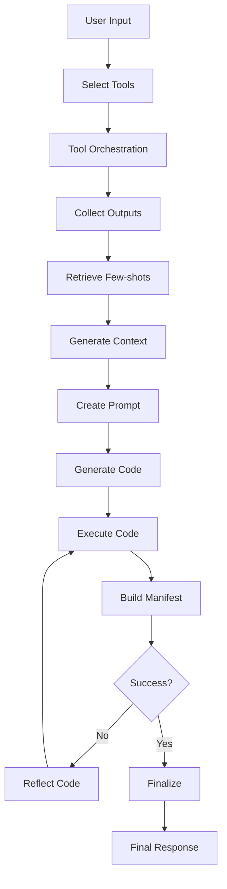

# Data Analytics Agent

A sophisticated data analytics agent built with **LangGraph orchestration**, **OpenAI Function Calling**, and **FAISS-based few-shot retrieval** for autonomous financial data analysis and quantitative research.

## Overview

This agent provides a complete workflow for data-driven financial analysis:

1. **Tool Selection** - Uses OpenAI function calling to select relevant tools
2. **FAISS-based Few-shot Retrieval** - Retrieves relevant examples with re-ranking
3. **Code Generation** - Uses OpenAI structured outputs for reliable code generation
4. **Code Execution** - Executes generated code with reflection loop for error handling
5. **LangGraph State Management** - Orchestrates the entire workflow with state persistence

## Architecture

### Core Components

```
data_analytics_agent/
├── data_analytics_agent.py      # Main agent orchestration
├── core/                        # Core functionality modules
├── few_shots/                   # Few-shot learning examples
├── tools_registry.py            # Tool plugin system
├── tools_clean.py              # Financial data extraction tools
├── validator.py                # Parameter validation
└── requirements.txt            # Dependencies
```

## Core Module Details (`core/`)

### `async_tools.py`
**Async Tool Execution Engine**
- **Rate Limiting**: Per-tool rate limits using `AsyncLimiter`
- **Retry Logic**: Exponential backoff with jitter using `tenacity`
- **Caching**: Two-tier caching (semantic + raw) with file locks
- **Parallel Execution**: Asyncio-based concurrent tool execution
- **DataFrame Normalization**: Automatic conversion and standardization

Key Features:
```python
class AsyncToolExecutor:
    # Configurable per-tool limits
    def _cfg(self, tool: str) -> ToolConfig:
        # Default: 5 calls/sec, 30s timeout, 3 retries
        return ToolConfig(calls_per_second=5.0, timeout_sec=30.0, max_retries=3)
```

### `caching.py`
**Two-Layer Caching System**
- **Raw Cache**: `raw_cache/{tool}/{sig}.json.gz` - Compressed JSON metadata
- **Semantic Cache**: `semantic_cache/{sem_key}/{sig}.parquet` - Normalized DataFrames
- **File Locking**: Thread-safe cache operations with `FileLock`
- **Signature-based**: Uses parameter hashing for cache keys

### `manifest_utils.py`
**Result Manifest Management**
- **Artifact Discovery**: Automatic scanning for tables and figures
- **Format Inference**: Auto-detection of file formats (parquet, csv, html, png, svg)
- **Metadata Extraction**: Row counts, column names, data types from Parquet metadata
- **Sanitization**: Repairs malformed manifest entries

### `manifests.py`
**Data Structure Definitions**
```python
@dataclass
class TableArtifact:
    path: str
    rows: int
    columns: List[str]
    schema: Optional[Dict[str, str]] = None
    description: Optional[str] = None

@dataclass
class FigureArtifact:
    path: str
    caption: Optional[str] = None
    format: Optional[str] = None  # html/png/svg

@dataclass
class ResultManifest:
    tables: List[TableArtifact]
    figures: List[FigureArtifact]
    metrics: Dict[str, Any]
    explanation: str
```

### `prompting_blocks.py`
**Standardized Prompting Templates**
- **PLOTLY_CONVENTIONS**: Dark theme, log scales, interactive HTML export
- **BACKTEST_HYGIENE**: No look-ahead, realistic frictions, position limits
- **STATS_RIGOR**: Sharpe ratio, PSR, bootstrap confidence intervals
- **OUTPUT_CONTRACT**: Mandatory data persistence and manifest creation

### `utils.py`
**Utility Functions**
- **Parameter Normalization**: Recursive dict/object normalization
- **Signature Generation**: Deterministic hash-based signatures for caching
- **JSON Serialization**: Canonical JSON with sorted keys

## Few-Shot Learning Examples (`few_shots/`)

### `factor_generation.py`
**Factor Engineering Examples**
- Moving average crossovers and differences
- Rolling beta calculations with market indices
- Time series momentum factors (12M-1M returns)
- SMA-based momentum signals (SMA20 - SMA200)

### `signal_generation.py`
**Trading Signal Examples** 
- Time series momentum signals (252D - 22D returns)
- Multi-asset momentum ranking systems
- Cross-asset factor generation for portfolio construction

### `simple_data_processing.py`
**Data Processing Patterns**
- Multi-ticker price merging and return calculations
- Cumulative return computations
- DataFrame manipulation with LangGraph state integration

### `simple_visuals.py`
**Visualization Examples**
- Factor vs. forward returns scatter plots
- Multi-axis plotting with Plotly dark theme
- Interactive HTML chart generation with state storage

### `statistical_analysis.py`
**Statistical Analysis Patterns**
- Credit spread analysis with statsmodels
- Multi-factor regression modeling
- Model validation and result storage

## Tool Registry System

### Plugin Architecture
```python
class ToolPlugin(ABC):
    rate_limit_cps: float = 5.0
    timeout_sec: float = 30.0
    max_retries: int = 3
    
    @abstractmethod
    def name(self) -> str: ...
    
    @abstractmethod
    def semantic_key(self) -> str: ...
    
    @abstractmethod
    def execute(self, params: Dict[str, Any]) -> Any: ...
```

### Available Tools

#### Stock Data
- **`extract_daily_stock_data`**: Single ticker OHLCV data from Polygon
- **`bulk_extract_daily_closing_prices_from_polygon`**: Multi-ticker closing prices

#### Economic Data
- **`extract_economic_data_from_fred`**: FRED economic indicators

#### Fundamental Data  
- **`extract_fundamentals_from_fmp`**: Financial fundamentals from FMP
- **`extract_analyst_estimates_from_fmp`**: Analyst estimates and targets

### Data Sources
- **Polygon.io**: High-quality stock market data
- **FRED**: Economic indicators from Federal Reserve
- **Financial Modeling Prep**: Fundamentals and analyst data

## Workflow Architecture

### LangGraph State Machine



### State Management

The agent maintains comprehensive state throughout execution:

```python
class AgentState(TypedDict):
    # Core workflow
    user_input: str
    selected_tools: List[str]
    generated_code: str
    execution_result: Dict[str, Any]
    
    # Tool integration
    tool_outputs: Dict[str, Any]
    tool_files: Dict[str, str]
    tool_artifacts: List[Dict[str, Any]]
    
    # Few-shot retrieval
    retrieved_few_shots: List[Dict[str, Any]]
    composite_prompt: str
    
    # Reflection & iteration
    reflection_count: int
    error_message: str
    
    # Directory management
    data_dir: str
    exec_workdir: str
    result_manifest: Any
```

## Key Features

### 1. Multi-turn Planning
- **Autonomous Decision Making**: No human intervention required
- **Parameter Validation**: Automatic correction of invalid parameters
- **Assumption Tracking**: Explicit logging of assumptions made
- **Plan Stability**: Detection of convergent planning states

### 2. FAISS Semantic Retrieval
- **Embedding-based Search**: `all-MiniLM-L6-v2` for example encoding
- **Cross-encoder Re-ranking**: `ms-marco-MiniLM-L-6-v2` for relevance scoring
- **Graceful Degradation**: Works without FAISS dependencies

### 3. Code Generation & Execution
- **Structured Outputs**: OpenAI structured outputs for reliable code generation
- **Reflection Loop**: Up to 3 attempts with error-based reflection
- **Sandbox Execution**: Isolated execution in iteration-specific directories
- **Artifact Management**: Automatic file discovery and cataloging

### 4. Enterprise-grade Reliability
- **Rate Limiting**: Configurable per-tool rate limits
- **Retry Logic**: Exponential backoff with jitter
- **Caching**: Persistent caching with file locking
- **Error Handling**: Comprehensive exception handling and recovery

## Setup and Installation

### Requirements

```bash
pip install -r requirements.txt
```

### Core Dependencies
- `pandas>=2.2.0` - Data manipulation
- `numpy>=1.26.0` - Numerical computing  
- `pydantic>=2.11.0` - Data validation
- `tenacity>=8.2.0` - Retry logic
- `aiolimiter>=1.1.0` - Rate limiting
- `plotly>=5.22.0` - Visualization
- `faiss-cpu` - Semantic search (optional)
- `sentence-transformers` - Embeddings (optional)

### Environment Variables

```bash
# Required
OPENAI_API_KEY=your_openai_api_key
POLYGON_API_KEY=your_polygon_api_key  # For stock data
FRED_API_KEY=your_fred_api_key        # For economic data
FMP_API_KEY=your_fmp_api_key          # For fundamentals

# Optional
OPENAI_MODEL=gpt-4                    # Default: gpt-5-mini
AGENT_DATA_DIR=/path/to/data          # Default: .agent_data
PLANNER_MAX_TURNS=3                   # Planning iterations
```

## Usage Examples

### Basic Usage

```python
from data_analytics_agent import DataAnalyticsAgent

# Initialize agent
agent = DataAnalyticsAgent()

# Process request
response = agent.process_request(
    "Create a moving average crossover strategy for AAPL and TSLA, "
    "going long when 10-day MA crosses above 50-day MA"
)

print(response)
```

### Advanced Multi-Asset Analysis

```python
response = agent.process_request(
    "For the last 4 years, extract US CPI data monthly and calculate "
    "rolling 2-year beta of AAPL, TSLA, NVDA, GOOGL, AMZN, MSFT, NFLX "
    "returns with CPI changes. Create a ranking strategy going long on "
    "low beta stocks and short on high beta stocks."
)
```

## Output Structure

### Data Directory Structure
```
.agent_data/
└── runs/
    └── {run_id}/
        └── reflection_{iteration}/
            ├── result.json         # Manifest
            ├── *.csv/*.parquet     # Data tables
            └── *.html/*.png        # Visualizations
```

### Result Manifest (`result.json`)
```json
{
  "tables": [
    {
      "path": "momentum_signals.csv",
      "rows": 252,
      "columns": ["date", "AAPL", "TSLA", "signal"]
    }
  ],
  "figures": [
    {
      "path": "strategy_backtest.html",
      "caption": "Moving Average Crossover Strategy",
      "format": "html"
    }
  ],
  "metrics": {
    "sharpe_ratio": 1.23,
    "max_drawdown": -0.15,
    "total_return": 0.34
  },
  "explanation": "Strategy analysis and results..."
}
```

## Advanced Configuration

### Custom Tool Configuration

```python
from core.async_tools import AsyncToolExecutor, ToolConfig

# Custom rate limits per tool
tool_overrides = {
    "bulk_extract_daily_closing_prices_from_polygon": ToolConfig(
        calls_per_second=1.0,  # Slower for bulk operations
        timeout_sec=120.0,     # Longer timeout
        max_retries=2          # Fewer retries
    )
}

executor = AsyncToolExecutor(
    registry=registry,
    data_dir="/path/to/data",
    tool_overrides=tool_overrides
)
```

### Custom Few-shot Examples

Add examples to `few_shots/` directory:

```python
# few_shots/custom_analysis.py
[{
    "question": "Calculate correlation matrix for multiple assets",
    "executable_code": "import pandas as pd\n# Your code here...",
    "code_description": "Calculates rolling correlation matrix..."
}]
```

## Best Practices

### 1. Data Management
- Use semantic keys for consistent data referencing
- Leverage caching for repeated analyses
- Organize data in date-first column format

### 2. Code Generation
- Follow OUTPUT_CONTRACT for consistent results
- Use Plotly dark theme for visualizations  
- Persist all intermediate results

### 3. Backtesting Hygiene
- Implement realistic trading costs and slippage
- Avoid look-ahead bias in signal generation
- Report comprehensive risk metrics

### 4. Performance Optimization
- Configure appropriate rate limits for data sources
- Use bulk extraction tools when possible
- Enable caching for repeated parameter sets

## Troubleshooting

### Common Issues

1. **Missing API Keys**: Ensure all required environment variables are set
2. **Rate Limit Errors**: Reduce `rate_limit_cps` in tool configuration
3. **Memory Issues**: Use parquet format for large datasets
4. **Code Execution Timeout**: Increase `CODE_EXECUTION_TIMEOUT`

### Debugging

Enable debug logging:
```python
import logging
logging.basicConfig(level=logging.DEBUG)
```

Check execution artifacts:
```bash
# View run directory
ls -la .agent_data/runs/{run_id}/

# Check manifest
cat .agent_data/runs/{run_id}/reflection_0/result.json
```

## Contributing

### Adding New Tools

1. Create tool plugin inheriting from `ToolPlugin`
2. Implement required abstract methods
3. Add validation logic in `validator.py`
4. Register in `tools_registry.py`

### Adding Few-shot Examples

1. Create new file in `few_shots/` directory
2. Follow the established JSON/Python format
3. Include `question`, `executable_code`, and `code_description`
4. Test with FAISS retrieval system

## License

This project is licensed under the MIT License. See LICENSE file for details.

## Support

For questions and support:
- Create an issue in the GitHub repository
- Review the troubleshooting section
- Check the example code in `few_shots/` directory